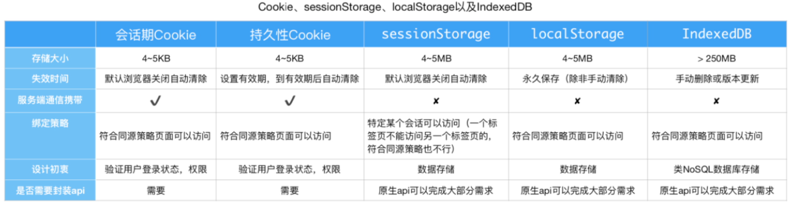
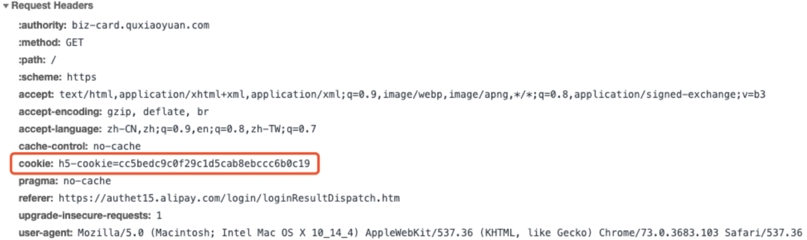

# 浏览器本地存储

## 目录

-   [Cookie](#Cookie)

-   [sessionStorage](#sessionStorage)

-   [localStorage](#localStorage)

-   [共同的Storage Api](#共同的Storage-Api)





## Cookie

`Cookie`说白了就是用来登录验证，在发送登录请求以后，服务器返回的响应头中设置`Set-Cookie`及其值。

`Cookie`遵循浏览器同源策略，在不同源的页面中访问不到当前页面的`cookie`，否则可以拿到`cookie`伪造请求进行`XSS`和`CSRF`攻击


会话期`cookie`（无设置过期时间）保存在内存中，持久性`cookie`（设置了过期时间）保存在硬盘中。

`cookie`会随着页面发送的请求再带回到服务端，然后服务端判断`cookie`的值，从未判断登录状态，在有效时间内，我们只要打开页面发送请求，就会默认是登录状态




上图就是携带cookie的请求，这不是前端手动在请求中携带上的，是浏览器的自主行为。

⚠️ 在`Ajax`、`Axios`、`Cors`以及`fetch`请求默认不携带`cookie`


## sessionStorage

遵循浏览器的同源策略，不同源的根本就访问不到

符合同源策略的，必须是同一个会话即使是相同地址，不是同一个会话也不行

如果通过点击链接（或者用了 `window.open`）打开的新标签页之间是属于同一个 `session`的

但新开一个标签页总是会初始化一个新的 `session`，即使网站是一样的，它们也不属于同一个 `session`


## localStorage

不手动进行删除的情况下，会一直保留，并且只要符合同源策略的页面，都是可以共享相同的`localStorage`


## 共同的Storage Api

获取web storage

```javascript
//  getItem('key')
var name = sessionStorage.getItem('name');
var name = localStorage.getItem('name');
//  object method
var name = sessionStorage.name;
var name = localStorage.name;
```


删除web storage

```javascript
//  remoteItem('key')
sessionStorage.removedItem('name');
localStorage.removedItem('name'); // 删除了key为name的value
//  object method
delete sessionStorage.name;
delete localStorage.name;
```


设置web storage

```javascript
//  setItem('key', 'value');
sessionStorage.setItem('name', 'Sonia');
localStorage.setItem('name', 'Sonia');
//  object method
sessionStorage.name = 'Sonia';
localStorage.name = 'Sonia';
```
